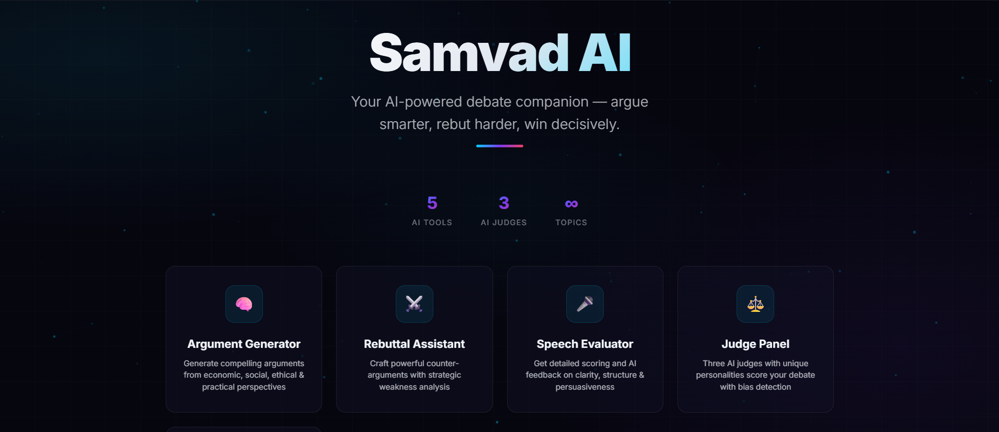
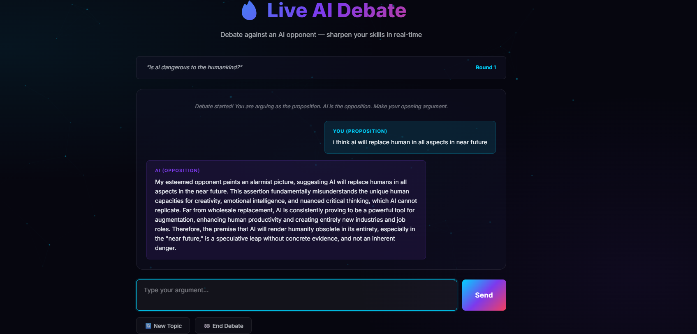
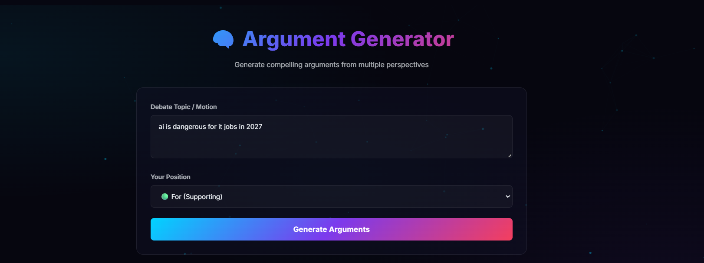
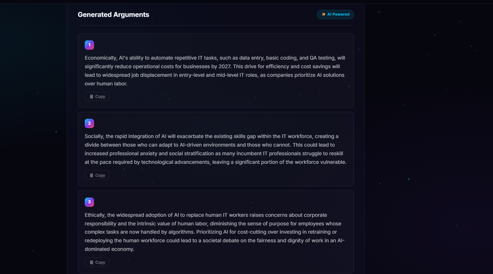
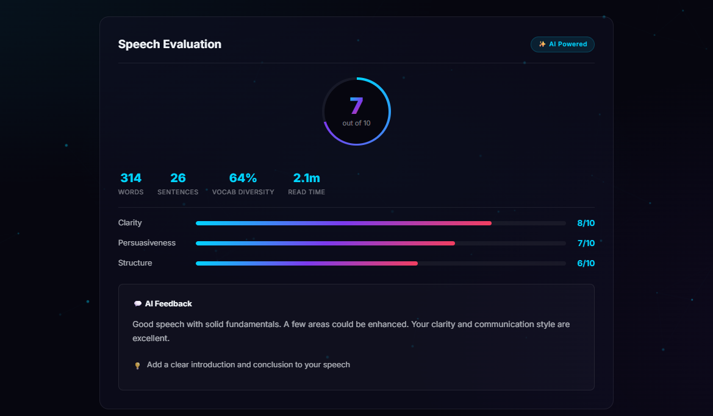

<div align="center">
  <h1>Samvad AI </h1>
  <p><b>Your AI-Powered Debate Companion</b></p>
  <p><i>Argue smarter. Rebut harder. Win decisively.</i></p>

  <div>
    
    
    
    
  </div>
</div>

---

## ✨ Overview

**Samvad AI** is an intelligent debate assistant powered by **Google Gemini AI**. Whether you're a seasoned debater or just starting out, Samvad AI gives you the edge by generating compelling arguments, crafting strategic rebuttals, providing actionable speech evaluation, and simulating real-time debates against an AI opponent.

---

## 🚀 Key Features

*   🧠 **Argument Generator** - Build structured cases across economic, social, ethical, & practical perspectives.
*   ⚔️ **Rebuttal Assistant** - Analyze opponent weaknesses and craft devastating counter-arguments.
*   🎤 **Speech Evaluator** - Receive comprehensive scoring on clarity, structure, and persuasiveness.
*   ⚖️ **The Judge Panel** - Face off in front of three distinct AI personas (Prof. Sharma 🎓, Justice Mehta ⚖️, Dr. Patel 📋).
*   🔥 **Live AI Debate** - Test your mettle against a real-time, Gemini-powered opponent.
*   📅 **Daily Motion** - Practice daily with fresh, curated debate topics.

---

## 📸 Screenshots

Here is a glimpse of the Samvad AI premium interface:

<div align="center">
  
  <br><i>The Main Dashboard featuring AI Debating Tools.</i><br><br>
  
  
  <br><i>Real-time Debate against a Gemini-powered opponent.</i><br><br>

  
  <br><i>Input interface for generating debate arguments.</i><br><br>

  
  <br><i>Structured arguments with distinct economic, social, and ethical perspectives.</i><br><br>

  
  <br><i>Detailed speech scoring, readability metrics, and action-oriented AI feedback.</i>
</div>

---

## 🛠️ Technology Stack

*   **Backend:** Python, Flask
*   **Frontend:** HTML5, CSS3, Vanilla JavaScript
*   **AI Engine:** Google Gemini 2.5 Flash
*   **Design:** Premium Glassmorphism UI, interactive particle backgrounds, animated gradients

---

## ⚡ Quick Start Guide

### 1. Clone & Install
```bash
git clone https://github.com/your-username/samvad-ai.git
cd samvad-ai
pip install -r requirements.txt
```

### 2. Configure Environment
Get your **free** API key from [Google AI Studio](https://aistudio.google.com/apikeys).
```bash
cp .env.example .env
# Open .env and add: GEMINI_API_KEY=your_actual_api_key_here
```

### 3. Launch
```bash
cd DebateMate
python app.py
# Open http://localhost:5000 in your browser
```

---

## 🤖 AI Under the Hood

Powered by **Google Gemini 2.5 Flash**, Samvad AI seamlessly integrates advanced AI capabilities:

*   **Dynamic Argumentation:** Generates context-aware reasoning and evidence.
*   **Strategic Analysis:** Identifies logical fallacies and vulnerabilities in opposing arguments.
*   **Hybrid Evaluation:** Combines heuristic scoring with deep qualitative LLM feedback.
*   **Persona Engine:** Simulates distinct judging styles with independent personalities.
*   **Robust Fallbacks:** Gracefully degrades to rule-based responses if API limits are reached.

---

## 🎨 A Premium UI Experience

*   🌑 Sleek dark theme featuring glassmorphism elements
*   ✨ Immersive, interactive Canvas API particle backgrounds
*   🎨 Dynamic gradient accents (electric blue → purple → pink)
*   📊 Beautifully animated score bars and data visualizations
*   📱 Fully responsive design across all devices

---

## 📄 License & Acknowledgments

*   Powered by [Google Gemini AI](https://ai.google.dev/) and [Flask](https://flask.palletsprojects.com/).
*   Typography by [Inter Font](https://fonts.google.com/specimen/Inter).
*   Licensed under the [MIT License](LICENSE).

<p align="center">
  Built with ❤️ by <strong>AMULYA</strong>
</p>
